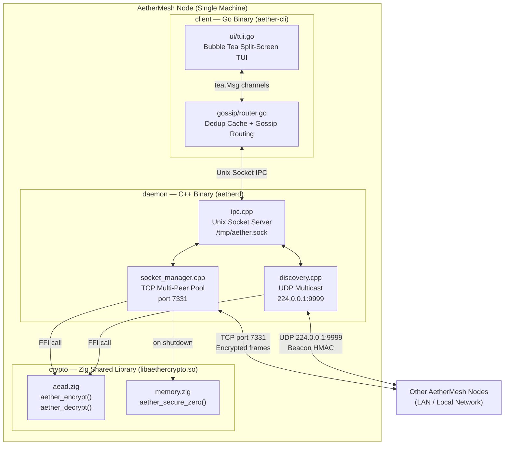
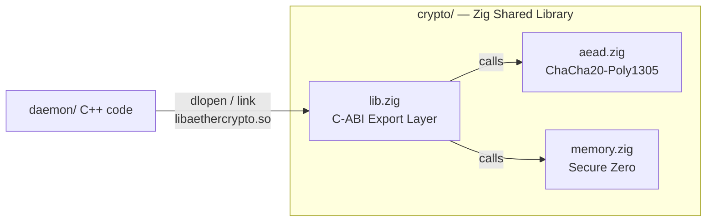
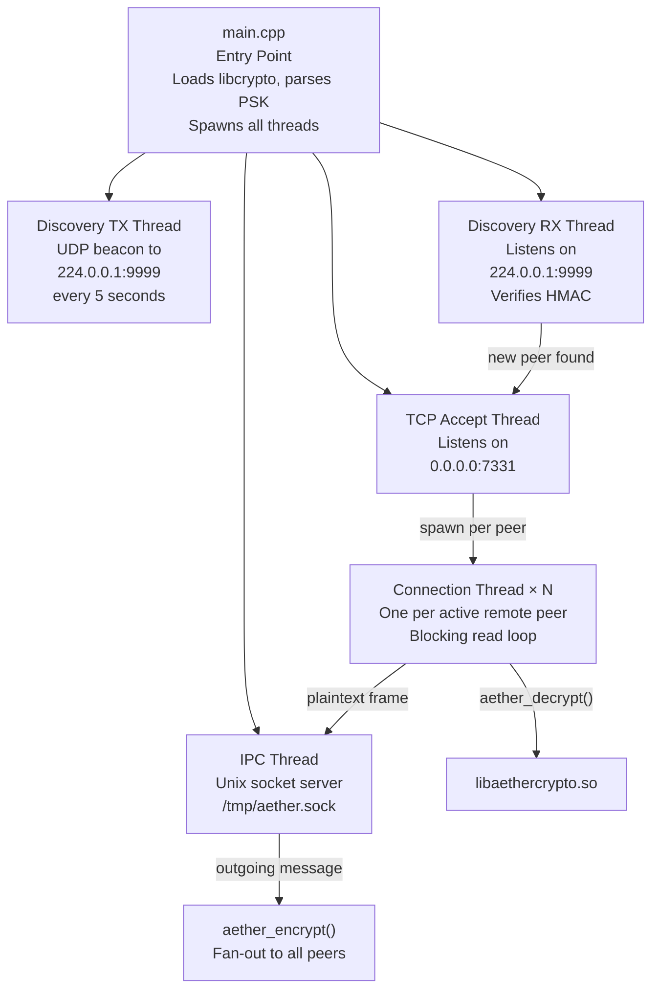
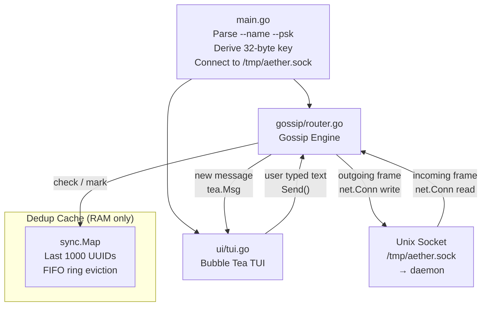
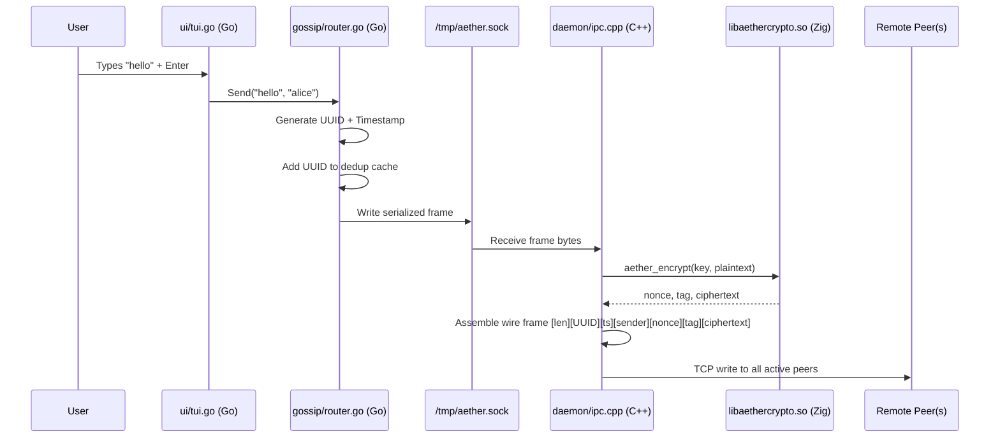
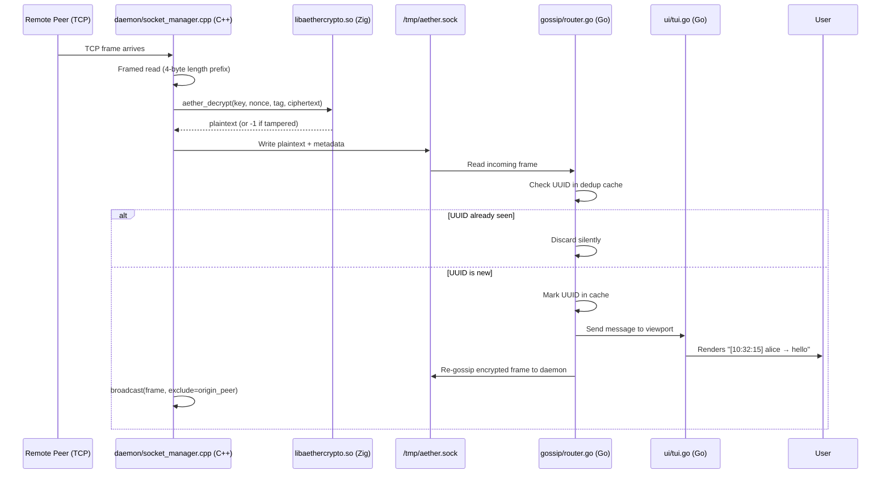
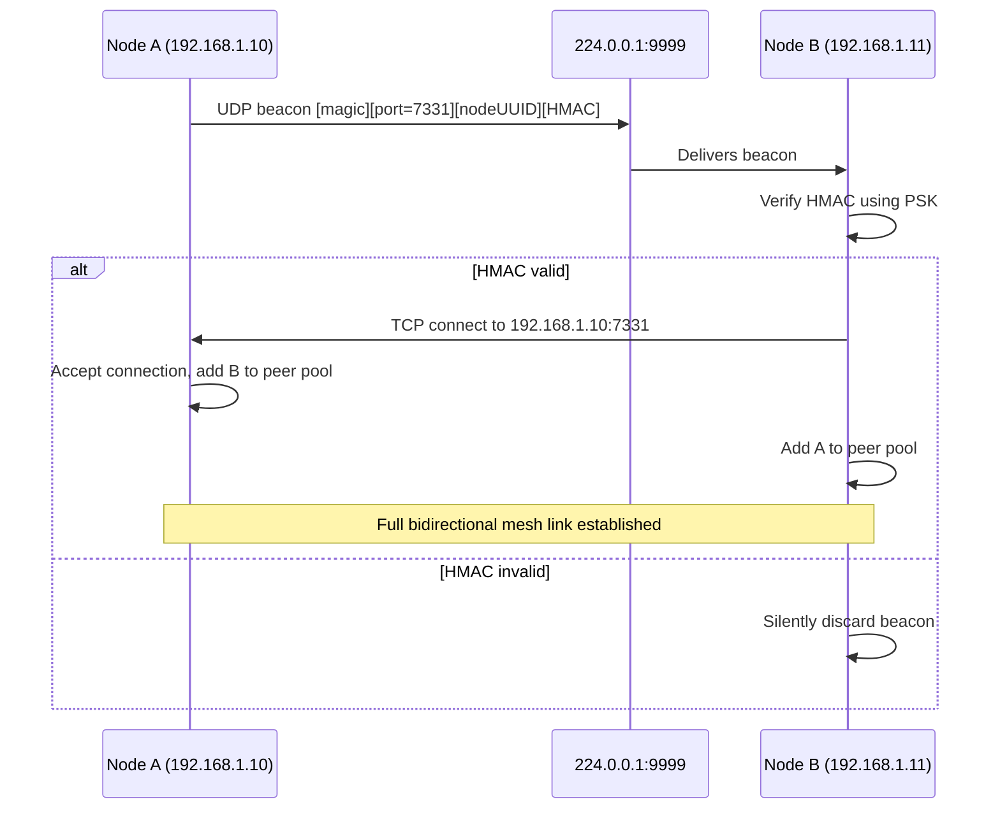
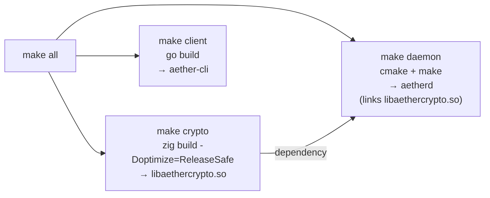
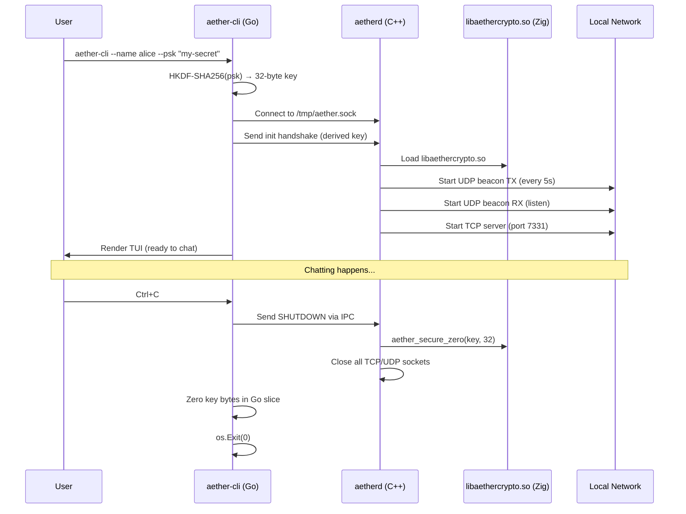
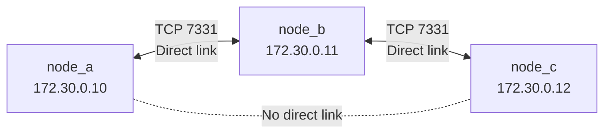

# AetherMesh — System Architecture

> **AetherMesh** is an offline-first, ephemeral, end-to-end encrypted peer-to-peer mesh chat system.
> It works over local networks with **zero internet dependency**, stores **nothing on disk**, and wipes all keys and messages from RAM on exit.

---

## Table of Contents

1. [System Overview](#1-system-overview)
2. [Project Folder Structure](#2-project-folder-structure)
3. [Component Architecture](#3-component-architecture)
4. [Wire Protocol Design](#4-wire-protocol-design)
5. [Security Model](#5-security-model)
6. [Data Flow Diagrams](#6-data-flow-diagrams)
7. [Build System](#7-build-system)
8. [Runtime Startup Sequence](#8-runtime-startup-sequence)
9. [Docker Test Topology](#9-docker-test-topology)
10. [Technology Stack](#10-technology-stack)

---

## 1. System Overview

### Division of Labor

| Component | Language | Binary / Library | Core Responsibility |
|-----------|----------|-----------------|---------------------|
| `crypto/` | **Zig** | `libaethercrypto.so` | ChaCha20-Poly1305 AEAD encryption, volatile RAM zeroing |
| `daemon/` | **C++** | `aetherd` | TCP multi-peer sockets, UDP multicast LAN discovery, IPC |
| `client/` | **Go** | `aether-cli` | Gossip protocol routing, deduplication, Bubble Tea TUI |

### High-Level Architecture



---

## 2. Project Folder Structure

```
AetherMesh/
│
├── Makefile                        ← Root build: compiles all 3 components
├── README.md                       ← Project overview and quick-start guide
├── .gitignore
├── docker-compose.yml              ← 3-node chain network test topology
│
├── docs/
│   └── architecture.md             ← THIS FILE
│
├── scripts/
│   ├── run_node.sh                 ← Helper: start daemon + client together
│   └── test_gossip.sh              ← Helper: spawn 3 local nodes and verify propagation
│
├── crypto/                         ← [ZIG] Cryptographic shared library
│   ├── build.zig                   ← Zig build config (outputs libaethercrypto.so)
│   ├── build.zig.zon               ← Zig package manifest
│   └── src/
│       ├── lib.zig                 ← C-ABI export entry points
│       ├── aead.zig                ← ChaCha20-Poly1305 encrypt / decrypt
│       └── memory.zig              ← Volatile RAM zeroing (secure_zero)
│
├── daemon/                         ← [C++] Network transport daemon
│   ├── CMakeLists.txt              ← CMake build config (links libaethercrypto.so)
│   └── src/
│       ├── main.cpp                ← Entry point, signal handlers, thread spawning
│       ├── socket_manager.hpp      ← TCP multi-peer connection pool interface
│       ├── socket_manager.cpp      ← TCP listener, framed read/write, broadcast
│       ├── discovery.hpp           ← UDP multicast beacon interface
│       ├── discovery.cpp           ← Beacon TX (every 5s) + RX (verify HMAC)
│       ├── ipc.hpp                 ← Unix Domain Socket IPC interface
│       └── ipc.cpp                 ← IPC server talking to Go client
│
└── client/                         ← [GO] Gossip router + TUI client
    ├── go.mod                      ← Go module (aethermesh/client)
    ├── go.sum
    ├── main.go                     ← CLI flags, PSK derivation, IPC connect, TUI launch
    ├── gossip/
    │   └── router.go               ← Message struct, dedup cache, gossip dissemination
    └── ui/
        └── tui.go                  ← Bubble Tea model: viewport + input + status bar
```

---

## 3. Component Architecture

### 3.1 Zig Crypto Library (`crypto/`)



#### Exported C Functions

```c
// Encrypt plaintext with a fresh random nonce per call
// Writes: 12-byte nonce, 16-byte Poly1305 tag, N-byte ciphertext
int aether_encrypt(
    const uint8_t  key[32],
    const uint8_t *plaintext,  size_t plaintext_len,
          uint8_t  out_nonce[12],
          uint8_t  out_tag[16],
          uint8_t *out_ciphertext   // caller allocates plaintext_len bytes
);

// Decrypt and verify authentication tag
// Returns 0 on success, -1 if tag fails (packet tampered or wrong key)
int aether_decrypt(
    const uint8_t  key[32],
    const uint8_t  nonce[12],
    const uint8_t  tag[16],
    const uint8_t *ciphertext, size_t ciphertext_len,
          uint8_t *out_plaintext    // caller allocates ciphertext_len bytes
);

// Guaranteed volatile zero — compiler cannot elide this call
void aether_secure_zero(void *ptr, size_t len);
```

#### Cryptographic Properties

| Property | Value |
|----------|-------|
| Algorithm | ChaCha20-Poly1305 (RFC 8439) |
| Key size | 256-bit (32 bytes) Pre-Shared Key |
| Nonce size | 96-bit (12 bytes), CSPRNG per message |
| Auth tag | 128-bit (16 bytes) Poly1305 MAC |
| Used in | TLS 1.3, WireGuard, Signal Protocol |
| Replay protection | Per-message random nonce |
| Tamper detection | Auth tag verification before any decryption |

---

### 3.2 C++ Transport Daemon (`daemon/`)



---

### 3.3 Go Client (`client/`)



#### TUI Layout

```
┌─────────────────────────────────────────────────────────────────┐
│  AetherMesh — Ephemeral Offline Chat              [peers: 3]    │  ← header bar
├─────────────────────────────────────────────────────────────────┤
│                                                                 │
│  [10:32:15]  alice  →  hey everyone                            │  ← message viewport
│  [10:32:47]  bob    →  hello from the other side               │     (scrollable)
│  [10:33:01]  you    →  this is working offline!                │     PgUp / PgDn
│                                                                 │
│                                                                 │
├─────────────────────────────────────────────────────────────────┤
│  You: █                                                         │  ← text input
│       /help  /peers  /quit                                      │  ← hint bar
└─────────────────────────────────────────────────────────────────┘
```

---

## 4. Wire Protocol Design

### 4.1 TCP Message Frame

Every message sent over TCP between AetherMesh nodes is framed as follows:

```
 Offset   Size     Field
 ──────   ──────   ──────────────────────────────────────────────
  0        4 B     Total frame length (little-endian uint32)
  4       16 B     Message UUID  (random bytes, per-message unique ID)
  20       8 B     Timestamp     (milliseconds since Unix epoch, uint64)
  28      32 B     Sender ID     (SHA-256 of sender display name)
  60      12 B     Nonce         (CSPRNG, fresh per message)
  72      16 B     Poly1305 Tag  (authentication MAC)
  88       N B     Ciphertext    (ChaCha20-Poly1305 encrypted payload)
 ──────   ──────   ──────────────────────────────────────────────
 Total header overhead: 88 bytes
```

### 4.2 UDP Discovery Beacon

```
 Offset   Size     Field
 ──────   ──────   ──────────────────────────────────────────────
  0        4 B     Magic bytes: 0xAE7H3E57  (AetherMesh protocol ID)
  4        2 B     TCP listening port (little-endian uint16)
  6       16 B     Node UUID (generated once at daemon startup)
  22      16 B     HMAC-SHA256(PSK, magic || port || nodeUUID) truncated
 ──────   ──────   ──────────────────────────────────────────────
 Total: 38 bytes per beacon
```

> [!NOTE]
> The HMAC in the beacon proves the beaconing node knows the Pre-Shared Key **before** a TCP connection is established. Nodes that fail HMAC verification are silently ignored.

---

## 5. Security Model

### 5.1 Threat Model

| Threat | Mitigation |
|--------|-----------|
| Network eavesdropper reads messages | ChaCha20-Poly1305 — ciphertext without PSK is unintelligible |
| Attacker modifies/injects frames in transit | Poly1305 auth tag — tampered frames are rejected before decryption |
| Replay attack (resend captured old message) | Per-message CSPRNG nonce — same plaintext → different ciphertext every time |
| Unauthorized node joins the mesh | Discovery beacon requires HMAC verification using PSK |
| History recovered from disk after exit | No disk writes — RAM only |
| History recovered from RAM after exit | `aether_secure_zero()` — volatile `@memset` guaranteed not optimized out |
| Compiler elides `memset` before free | Zig volatile semantics ensures zeroing is always emitted |

### 5.2 Limitations (v1 Non-Goals)

> [!WARNING]
> The following features are **not** present in v1 and are planned for future versions:

- **No Perfect Forward Secrecy (PFS):** Static PSK means a captured key can decrypt past traffic. Future: X25519 ECDH ephemeral key exchange.
- **Message lengths visible:** An observer can see packet sizes. Future: fixed-size padding.
- **No per-peer identity certificates:** Any holder of the PSK can join. Future: signed peer certificates.

---

## 6. Data Flow Diagrams

### 6.1 Sending a Message



### 6.2 Receiving a Gossiped Message



### 6.3 Peer Discovery Flow



---

## 7. Build System



**Available make targets:**

| Target | Action |
|--------|--------|
| `make all` | Build all three components in dependency order |
| `make crypto` | Build Zig shared library only |
| `make daemon` | Build C++ daemon (requires crypto built first) |
| `make client` | Build Go client |
| `make clean` | Remove all build artifacts |
| `make docker` | Build all Docker images |
| `make test` | Run 3-node gossip simulation locally |

---

## 8. Runtime Startup Sequence



---

## 9. Docker Test Topology

### Chain Network — Gossip Validation



> [!IMPORTANT]
> **Test Objective:** Send a message from `node_a`. It must arrive at `node_c` only through `node_b` (gossip hop). This validates multi-hop propagation and UUID deduplication preventing infinite loops.

**Docker network rules:**
- `net_ab` subnet: only `node_a` and `node_b` can communicate
- `net_bc` subnet: only `node_b` and `node_c` can communicate
- `node_a` and `node_c` are on different subnets — zero direct path

---

## 10. Technology Stack

| Layer | Technology | Version | Purpose |
|-------|-----------|---------|---------|
| Crypto Library | Zig | 0.12.1 | ChaCha20-Poly1305, RAM zeroing, C-ABI exports |
| Network Daemon | C++ | C++20 (g++ 12+) | TCP sockets, UDP multicast, thread pools |
| TUI Client | Go | 1.22+ | Gossip routing, deduplication, terminal interface |
| TUI Framework | Bubble Tea (Charm) | v0.27+ | Split-screen interactive terminal |
| TUI Styling | Lip Gloss (Charm) | v0.10+ | Colors, borders, layout in terminal |
| Build System | GNU Make | 4.x | Orchestrates all three component builds |
| C++ Build | CMake | 3.20+ | C++ compilation and linking |
| Containerization | Docker Compose | v2 | Multi-node gossip testing |

---

*Architecture Version: 1.0 — AetherMesh*
