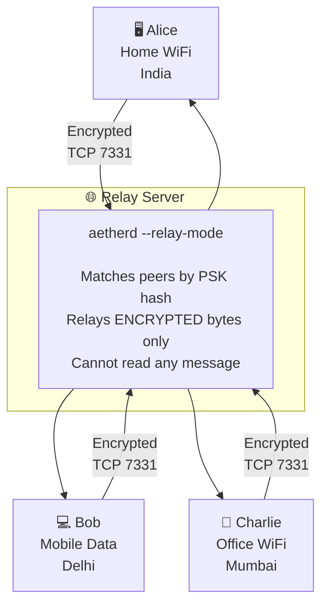
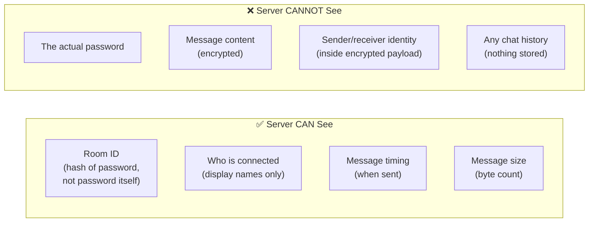
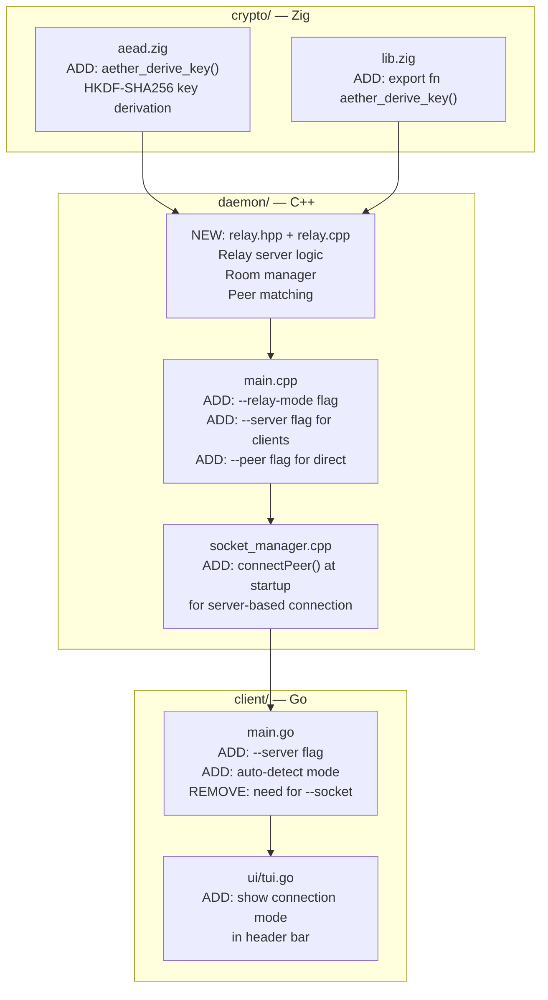
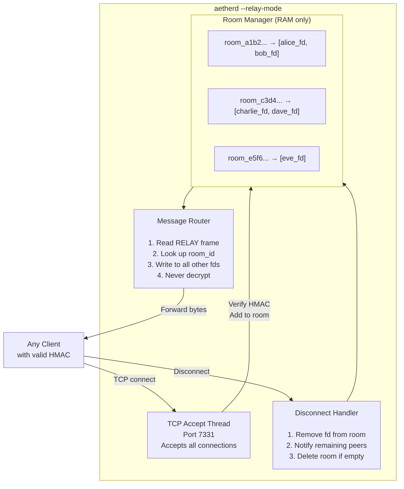

# AetherMesh — External Server Plan

> **Goal:** Alice and Bob connect from anywhere on the internet using only a shared password.
> No same WiFi. No same LAN. Just an internet connection and a password.

---

## How It Works in One Picture



---

## Connection Flow — Step by Step

```mermaid
sequenceDiagram
    participant A as Alice's Terminal
    participant AD as Alice's Daemon
    participant S as Relay Server
    participant BD as Bob's Daemon
    participant B as Bob's Terminal

    Note over A,B: Shared PSK = "our-secret-password"

    rect rgb(20, 40, 60)
        Note over AD,S: Alice connects
        AD->>S: TCP connect to 1.2.3.4:7331
        AD->>S: HELLO frame\n{room=SHA256(PSK)[0:16], hmac=HMAC(PSK,room), name="alice"}
        S->>S: Verify HMAC ✅
        S->>S: Register alice in room
        S-->>AD: ACK {peers_in_room: 0}
    end

    rect rgb(20, 60, 40)
        Note over BD,S: Bob connects
        BD->>S: TCP connect to 1.2.3.4:7331
        BD->>S: HELLO frame\n{room=SHA256(PSK)[0:16], hmac=HMAC(PSK,room), name="bob"}
        S->>S: Verify HMAC ✅
        S->>S: Register bob in same room
        S-->>BD: ACK {peers_in_room: 1}
        S-->>AD: PEER_JOINED {name: "bob"}
    end

    Note over A,B: Both connected → Chat begins

    rect rgb(60, 20, 40)
        Note over A,B: Alice sends "hello bob"
        A->>AD: Type "hello bob"
        AD->>AD: aether_encrypt(key, "hello bob") → ciphertext
        AD->>S: RELAY frame {ciphertext, nonce, tag}
        S->>S: Look up room → forward to all others
        S->>BD: RELAY frame {ciphertext, nonce, tag}
        BD->>BD: aether_decrypt(key, ciphertext) → "hello bob"
        BD->>B: Display "[16:30] alice → hello bob"
    end
```



---

## What the Server Sees vs What It Cannot See



---

## Files to Create / Modify



---

## New CLI Interface

### On the Relay Server (VPS — runs 24/7)
```bash
./aetherd --relay-mode --port 7331
```

### On Alice's machine (anywhere)
```bash
# Terminal 1 — start daemon pointing to server
./aetherd --psk "our-password" --name alice --server 1.2.3.4:7331

# Terminal 2 — start chat client
./aether-cli --name alice --psk "our-password"
```

### On Bob's machine (anywhere)
```bash
# Terminal 1
./aetherd --psk "our-password" --name bob --server 1.2.3.4:7331

# Terminal 2
./aether-cli --name bob --psk "our-password"
```

---

## Relay Server Internal Design



---

## New Wire Frames

### HELLO Frame (Client → Server on connect)

```
Offset   Bytes   Field
──────   ─────   ───────────────────────────────────────
  0        4     Magic: "HLOA"
  4       16     Room ID = SHA256(PSK)[0..16]
 20       32     HMAC = HMAC-SHA256(PSK, room_id)
 52        1     Name length (max 32)
 53        N     Display name
```

### ACK Frame (Server → Client after HELLO)

```
Offset   Bytes   Field
──────   ─────   ───────────────────────────────────────
  0        4     Magic: "HLOK"
  4        1     Number of existing peers in room
  5        M     Peer names (1 byte len + N bytes each)
```

### RELAY Frame (Client → Server → All peers in room)

```
Offset   Bytes   Field
──────   ─────   ───────────────────────────────────────
  0        4     Magic: "RLAY"
  4        4     Payload total length
  8       16     Message UUID
 24       12     Nonce (CSPRNG, per message)
 36       16     Poly1305 Auth Tag
 52        N     Ciphertext (ChaCha20 encrypted)
```

### PEER_JOINED Frame (Server → All peers in room)

```
Offset   Bytes   Field
──────   ─────   ───────────────────────────────────────
  0        4     Magic: "PJND"
  4        1     Name length
  5        N     New peer display name
```

---

## Security Properties

| Property | How Achieved |
|----------|-------------|
| **No password on wire** | Only HMAC(PSK, room_id) sent — PSK never transmitted |
| **Server blind to content** | Only ciphertext forwarded — ChaCha20 key never leaves client |
| **Room isolation** | Different PSK → different room_id → zero cross-room leakage |
| **Auth enforcement** | Wrong HMAC → connection dropped immediately |
| **No history** | Server holds zero messages — only active connections in RAM |
| **Memory wipe** | `aether_secure_zero()` on all keys when client exits |
| **Replay protection** | Fresh CSPRNG nonce per message → same plaintext = different ciphertext |

---

## Phased Implementation

### Phase 1 — Relay Server (`relay.cpp`)
- Write `relay.hpp` and `relay.cpp` in daemon
- Implement `RoomManager` class (thread-safe map of room_id → peer fds)
- Implement HELLO handshake and HMAC verification
- Implement RELAY frame forwarding
- Add `--relay-mode` flag to `main.cpp`

### Phase 2 — Client Server Mode
- Add `--server IP:PORT` flag to daemon
- On startup: connect to relay server, send HELLO frame
- Receive PEER_JOINED events, update IPC peer count
- Forward all outgoing messages as RELAY frames to server

### Phase 3 — HKDF Key Derivation (Zig)
- Add `aether_derive_key()` to `crypto/src/lib.zig`
- Use HKDF-SHA256: `key = HKDF(ikm=PSK, salt="aethermesh", info="enc")`
- Use same derivation on both daemon and Go client

### Phase 4 — Go Client Update
- Remove manual `--socket` flag (auto-generate path from PSK)
- Add `--server` passthrough flag
- Show `[relay]` or `[direct]` in TUI header bar
- Show server latency in `/peers` command output

### Phase 5 — Auto-Mode Fallback
- Try LAN multicast for 3 seconds first
- If no peers found and `--server` given → connect to relay server
- If `--peer` given → direct TCP connect
- Priority: `--peer` > LAN > relay server

---

## Deployment

### Cheapest Server Options

| Provider | Cost | Specs |
|----------|------|-------|
| Hetzner CX11 | €4/month | 2 vCPU, 2GB RAM |
| Oracle Free Tier | Free | 1 OCPU, 1GB RAM |
| Fly.io | Free tier | Shared CPU |
| Raspberry Pi (home) | One-time ₹4000 | Port forward needed |

### Server Setup Commands
```bash
# On server (Ubuntu/Debian)
scp aetherd user@SERVER_IP:~/
ssh user@SERVER_IP

# Allow port 7331 through firewall
sudo ufw allow 7331/tcp

# Run relay server (keep alive with systemd or screen)
screen -S aethermesh
./aetherd --relay-mode --port 7331

# Detach: Ctrl+A then D
# Re-attach: screen -r aethermesh
```

### Systemd Service (Auto-start on reboot)
```ini
[Unit]
Description=AetherMesh Relay Server
After=network.target

[Service]
ExecStart=/home/ubuntu/aetherd --relay-mode --port 7331
Restart=always
RestartSec=3

[Install]
WantedBy=multi-user.target
```

---

## Final User Experience

**Share just one thing with your friend:**
```
Server: 1.2.3.4
Password: our-secret-password
```

**Alice runs:**
```bash
./aetherd --psk "our-secret-password" --name alice --server 1.2.3.4:7331
./aether-cli --name alice --psk "our-secret-password"
```

**Bob runs:**
```bash
./aetherd --psk "our-secret-password" --name bob --server 1.2.3.4:7331
./aether-cli --name bob --psk "our-secret-password"
```

**TUI result:**
```
┌────────────────────────────────────────────────────────────────────┐
│  AetherMesh — Ephemeral Offline Chat      [peers: 1] [via relay]  │
├────────────────────────────────────────────────────────────────────┤
│                                                                    │
│  [16:30:12]  bob    →  hey alice, this works from anywhere!       │
│  [16:30:18]  alice  →  no internet routing needed, just a server! │
│                                                                    │
├────────────────────────────────────────────────────────────────────┤
│  You ❯ █                                                          │
│        /help  /peers  /quit                                       │
└────────────────────────────────────────────────────────────────────┘
```

*Server cannot read a single word of this conversation.*

---

*Ready to implement Phase 1 — the relay server core.*
